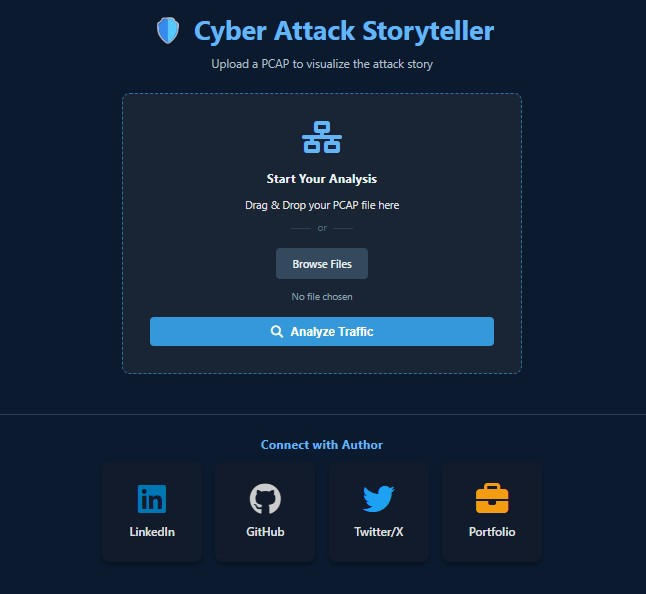
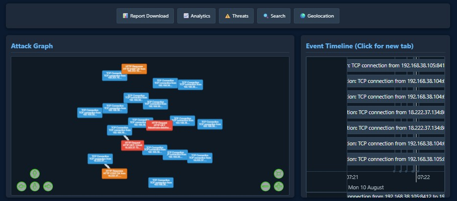
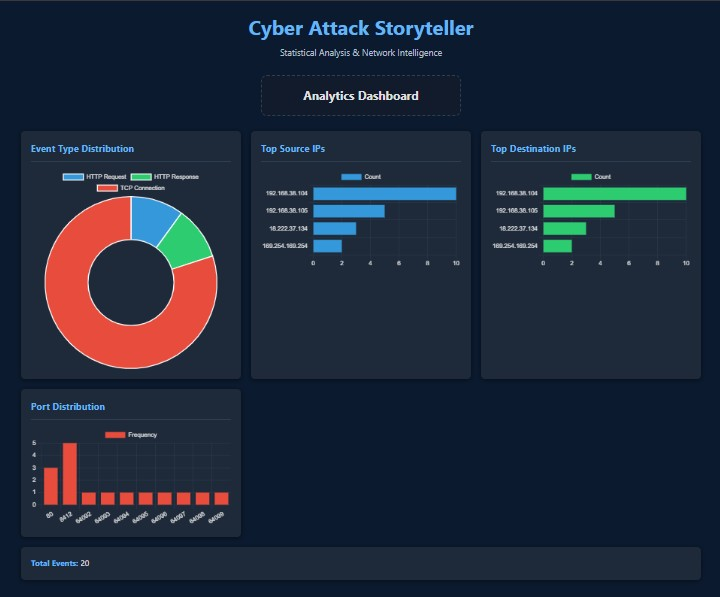

# 🛡️ PCAP Storyteller

**The Cyber Attack Storyteller**

Transform PCAP network traffic into an interactive, visual storyboard of cyber attacks. Analyze network events, visualize attack patterns, detect threats, and generate professional reports.

**Made By Kaif Tarasgar**

---

## 🚀 Features

### Core Analysis
- 📊 **PCAP Parser** - Extracts TCP, UDP, DNS, HTTP, TLS, ICMP, ARP events
- 🔗 **Causal Linking** - Automatically links DNS queries to HTTP requests and TLS handshakes
- 📈 **Attack Graph** - Interactive graph visualization of network events and relationships
- ⏱️ **Event Timeline** - Chronological view of all network events with filtering

### Advanced Intelligence
- ⚠️ **Threat Detection** - Identifies port scanning, data exfiltration, and suspicious patterns
- 🎯 **Risk Scoring** - Assigns threat scores (0-100) to each event
- 🌍 **Geolocation** - Maps IP addresses to geographic locations with interactive Leaflet maps
- 📊 **Analytics Dashboard** - Statistical insights: top IPs, ports, protocols, traffic heatmaps
- 🔍 **Advanced Search** - Filter by IP, domain, event type, time range

### Reporting & Export
- 📄 **PDF Reports** - Professional multi-page reports with summaries and tables
- 📝 **Word Documents** - DOCX format for easy editing and sharing
- 📅 **Timestamp Breakdown** - Clean event details with source/destination analysis
- 💾 **JSON Export** - Raw event data for further analysis

---

## � Screenshots

<p align="center">
  
  
</p>
<p align="center">
  
  
</p>

---

## �📋 Requirements

- **Python 3.7+**
- **Flask** - Web framework
- **Scapy** - Packet parsing
- **ReportLab** - PDF generation
- **python-docx** - Word document generation
- **requests** - HTTP library for GeoIP lookups

---

## ⚡ Quick Start

### 1. **Install Dependencies**

```bash
cd backend
pip install -r requirements.txt
```

### 2. **Run the Application**

```bash
python app.py
```

The application will start on `http://localhost:5000`

### 3. **Upload & Analyze**

1. Open your browser to `http://localhost:5000`
2. Click "Analyze PCAP" and select your PCAP/PCAPng file
3. Wait for analysis to complete
4. Explore the results using the navigation buttons

---

## 🎯 Usage Guide

### Dashboard Navigation

After analyzing a PCAP, use these tabs for different views:

| Button | Purpose |
|--------|---------|
| 📊 **Report** | Download PDF or Word reports |
| 📈 **Analytics** | View charts and statistics (event distribution, top IPs, ports) |
| ⚠️ **Threats** | See detected attack patterns and risk scores |
| 🔍 **Search** | Search events by IP, domain, or type |
| 🌍 **Geolocation** | View IP locations on an interactive map |
| ⏱️ **Timeline** | Dedicated timeline view in new tab |

### Keyboard Shortcuts

- `Ctrl+F` or `Ctrl+K` - Open search in new tab

---

## 📁 Project Structure

```
cyber-attack-storyteller/
├── backend/
│   ├── app.py                 # Flask application & API endpoints
│   ├── pcap_parser.py         # PCAP parsing engine
│   ├── threat_analyzer.py     # Threat detection & scoring
│   ├── requirements.txt       # Python dependencies
│   ├── events.json            # Generated event data
│   └── uploads/               # Temporary PCAP uploads
├── static/
│   ├── script.js              # Main dashboard JavaScript
│   ├── timeline.js            # Timeline page logic
│   ├── shared.js              # Shared utilities
│   └── style.css              # Dark theme styling
├── templates/
│   ├── index.html             # Main dashboard
│   ├── analytics.html         # Analytics page with charts
│   ├── threats.html           # Threat intelligence page
│   ├── search.html            # Search & filter page
│   ├── geolocation.html       # Geolocation map
│   ├── timeline.html          # Dedicated timeline view
│   └── report.html            # Report download page
└── README.md                  # This file
```

---

## 🔧 API Endpoints

### Core
- `POST /upload` - Upload and analyze PCAP file
- `GET /` - Main dashboard
- `GET /timeline` - Timeline view
- `GET /report` - Report page
- `GET /events.json` - Raw event data

### Analytics & Intelligence
- `GET /analytics` - Analytics dashboard
- `GET /threats` - Threats page
- `GET /search` - Search page
- `GET /geolocation` - Geolocation page

### Data APIs
- `GET /api/analytics` - Event statistics JSON
- `GET /api/threats` - Threat scores and patterns JSON
- `GET /api/search?q=<query>&field=<field>` - Search results
- `GET /api/geoips` - GeoIP data for all IPs
- `GET /api/geoip/<ip>` - GeoIP data for specific IP
- `GET /report/pdf` - Download PDF report
- `GET /report/docx` - Download Word report

---

## 🎨 Supported File Formats

- `.pcap` - Standard packet capture format
- `.pcapng` - PCAP Next Generation format
- `.cap` - Alternative capture format

All formats are automatically detected and parsed.

---

## 📊 Analysis Features

### Event Types Detected

| Type | Details |
|------|---------|
| **TCP Connection** | SYN handshakes with ports and flags |
| **DNS Query** | Domain lookups with query IDs |
| **DNS Response** | IP resolutions with domain mappings |
| **HTTP Request** | Methods (GET/POST), hosts, URIs, user agents |
| **HTTP Response** | Status codes and response phrases |
| **TLS SNI** | Server names from TLS handshakes |
| **ICMP** | Ping, unreachables, type/code info |
| **ARP** | Requests and replies with hardware addresses |

### Threat Detection Patterns

- 🔴 **Port Scanning** - Multiple unique ports from single source
- 🔴 **Possible Data Exfiltration** - Unusual HTTP traffic volumes
- 🟡 **DNS to Connection** - Suspicious query followed by immediate connection
- 🟡 **Suspicious Domains** - Queries containing keywords like "malware", "c2", "exploit"

### Risk Scoring

Events are scored 0-100 based on:
- Port suspiciousness (raw, privileged, common scan ports)
- Protocol usage (POST/PUT higher risk)
- Suspicious keywords in domains
- External IP sources
- Payload indicators

Threat Levels:
- 🔴 **CRITICAL** - Score ≥ 70
- 🟠 **HIGH** - Score ≥ 50
- 🟡 **MEDIUM** - Score ≥ 30
- 🟢 **LOW** - Score < 30

---

## 💡 Examples

### Analyze a Sample Attack

```bash
# 1. Start the server
python backend/app.py

# 2. Upload a PCAP file via the web interface
# 3. Wait for processing

# 4. View Results:
# - Attack Graph: Visual relationship between events
# - Analytics: Event distribution and top IPs
# - Threats: Risk scores and suspicious patterns
# - Reports: Download PDF/Word for stakeholders
```

---

## 🔒 Security Notes

- PCAP files are **automatically deleted** after processing
- Generated reports contain **no raw payloads** by default
- GeoIP lookups use **free public API** (ipapi.co)
- All analysis is **local** - no data sent externally except GeoIP

---

## 🚀 Performance

- **Small PCAPs** (<100 events): Instant
- **Medium PCAPs** (100-1000 events): 1-5 seconds
- **Large PCAPs** (>1000 events): 5-30 seconds

For very large files, consider filtering by time range or protocol before analysis.

---

## 🛠️ Troubleshooting

### Issue: "Scapy not installed"
**Solution:** `pip install scapy`

### Issue: "Import could not be resolved"
**Solution:** Configure VS Code to use the correct Python interpreter from your venv

### Issue: GeoIP not working
**Solution:** Ensure internet connection is available (uses ipapi.co)

### Issue: Large PCAP causes timeout
**Solution:** Process in smaller time windows or filter protocols

---

## 📈 Roadmap

- [ ] Live packet capture mode
- [ ] YARA rule integration for malware detection
- [ ] Machine learning threat prediction
- [ ] Multi-file comparison
- [ ] Network baseline anomaly detection
- [ ] MISP/STIX format export
- [ ] Database storage for large datasets

---

## � Deployment

You can deploy this application easily on **Render** (or Heroku, AWS).

1. **Fork/Clone** this repository to your GitHub.
2. Sign up on [Render.com](https://render.com).
3. Click **"New +"** → **"Web Service"**.
4. Connect your GitHub repository.
5. Render will automatically detect the configuration from `render.yaml`.
6. Click **Create Web Service**.

That's it! Your PCAP Storyteller will be live in minutes.

---

## �🙏 Acknowledgments

- [vis.js](https://visjs.org/) - Network visualization
- [Scapy](https://scapy.net/) - Packet manipulation
- [Leaflet](https://leafletjs.com/) - Map visualization
- [Chart.js](https://www.chartjs.org/) - Data visualization
- [Flask](https://flask.palletsprojects.com/) - Web framework

---

## 👤 Connect with Author

**Kaif Tarasgar**

<div style="display: flex; gap: 10px;">
<a href="https://www.linkedin.com/in/kaif-tarasgar-0b5425326/"></a>
<a href="https://github.com/Kaif-T-200"></a>
<a href="https://x.com/Kaif_T_200"></a>
<a href="#"></a>
</div>

---

**Made with ❤️ by Kaif Tarasgar**